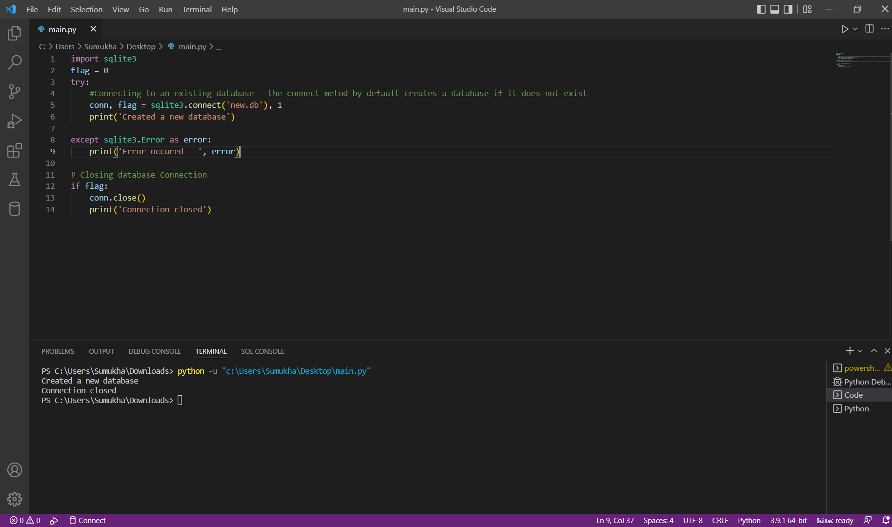

```
import sqlite3
flag = 0
try:
    #Connecting to an existing database - the connect metod by default creates a database if it does not exist
    conn, flag = sqlite3.connect('new.db'), 1
    print('Created a new database')

except sqlite3.Error as error:
    print('Error occured - ', error)
  
# Closing database Connection
if flag:
    conn.close()
    print('Connection closed')
```

