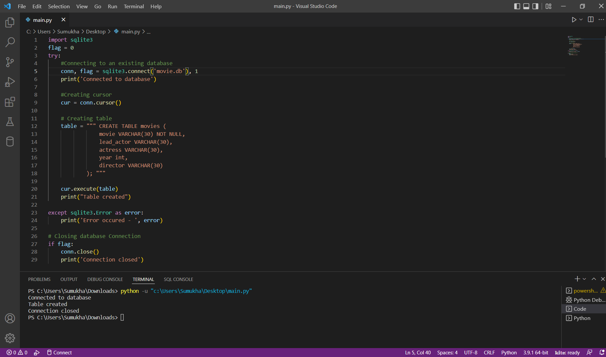

```
import sqlite3
flag = 0
try:
    #Connecting to an existing database
    conn, flag = sqlite3.connect('movie.db'), 1
    print('Connected to database')

    #Creating cursor
    cur = conn.cursor()
    
    # Creating table
    table = """ CREATE TABLE movies (
                movie VARCHAR(30) NOT NULL,
                lead_actor VARCHAR(30),
                actress VARCHAR(30),
                year int,
                director VARCHAR(30)
            ); """

    cur.execute(table)
    print("Table created")

except sqlite3.Error as error:
    print('Error occured - ', error)
  
# Closing database Connection
if flag:
    conn.close()
    print('Connection closed')
```

